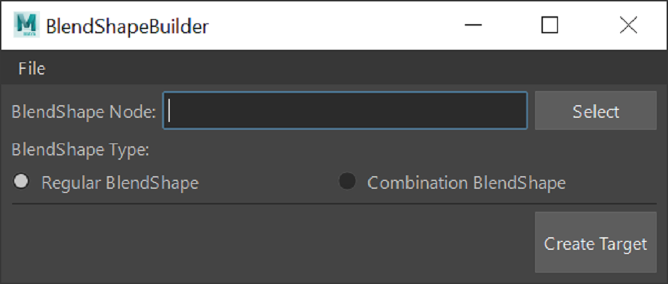

# BlendShape Builder Tool

Author: Eric Hug 



## Requirements
* Maya 2022.5 (with python 3) through 2025

## Installation
* Place downloaded folder into your local "maya/scripts" folder. (Make sure it is named "blendShape_builder" and *not* "blendShape_builder-main")
* Open Maya.
* Open Maya's Script Editor. In a Python tab, run the tool using the following python code:
```python
from importlib import reload
from blendShape_builder import view
reload(view)
view.start_up()
```

## Usage
### Setting up your Sculpted Poses Beforehand:
In order for this tool to help, you must have meshes with sculpted corrections beforehand. To begin sculpting:
1. Move your rig into the pose you want to fix. 
2. For a generic corrective blendshape, make sure only your skinCluster deformer is active. If you're trying to make a combination blendshape, make sure your blendShape node is active, as well as the blendShape targets you want to trigger your new combinationShape. 
3. You can choose to duplicate your mesh and sculpt corrections within Maya, or another option is to export posed mesh as .obj and bring into ZBrush and create corrections using ZBrushs layer system.
4. If you sculpt with Maya, there shouldn't be any other prior setup work you need to do. If you chose to sculpt with ZBrush, export your corrections as an obj.
### Using the BlendShape Builder Tool
* **Step 1:** Import your sculpted corrected meshes.
* **Step 2:** Select the skinned mesh and then select the BlendShape Node in question within the Attribute Editor (you'll know it's selected when you see its attributes opened, starting with the attribute "envelope", which you want set to a value of 1 if it isn't already).
* **Step 3:** Press the "Select" button to confirm the blendshape node.
* **Step 4:** Pose your skinned mesh.
* **Step 5:** Select only your sculpted mesh (and **_only_** the sculpted mesh).
* **Step 6:** Choose your target type (regular or combination) and then press "Create Target".

### Tool Demo
https://vimeo.com/1043202942
